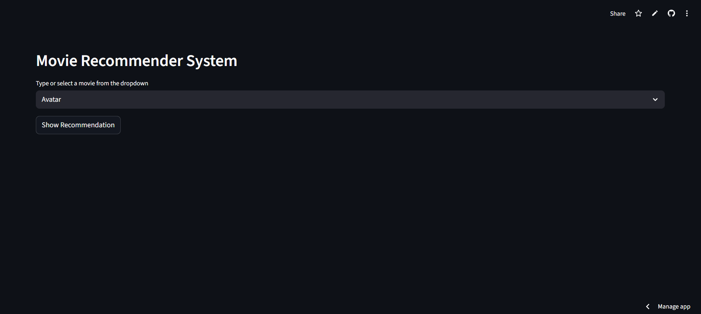
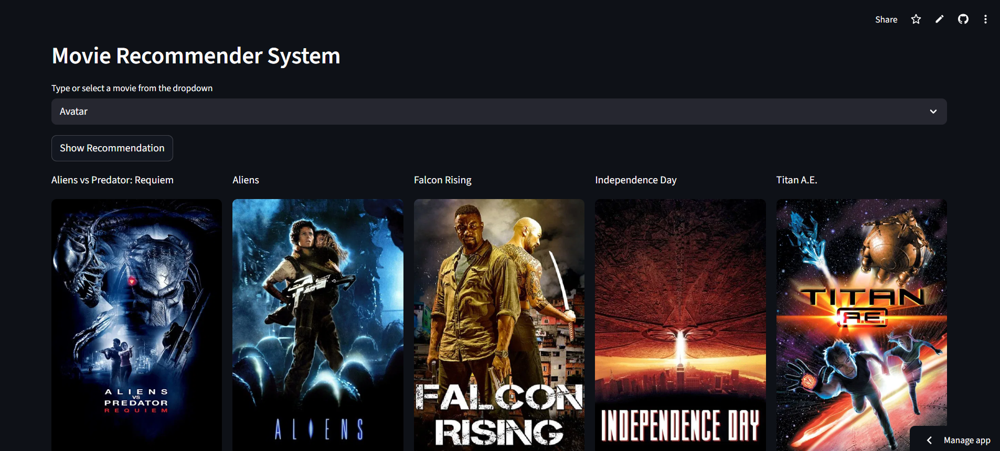
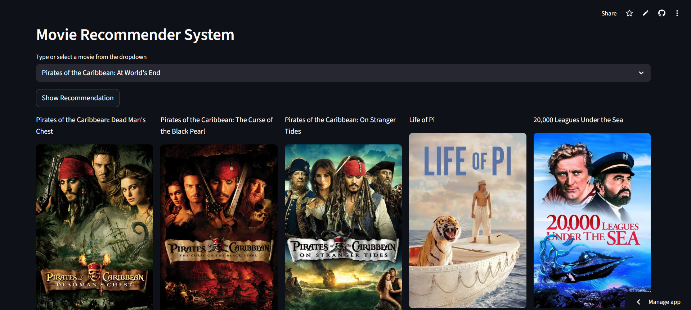

# 🎬 Movie Recommendation System

A content-based Movie Recommendation System built using Natural Language Processing techniques and deployed using Streamlit.

🔗 **Live Demo:**  
https://movierecommendationsystem-gd28yx72hhdmti2gp24nhm.streamlit.app/

---

## 🚀 Overview

This project recommends movies similar to a selected movie using:

- NLP (CountVectorizer)
- Cosine Similarity
- Content-based filtering
- TMDB API integration for real-time movie posters
- Streamlit for web deployment

The system analyzes movie metadata such as genres, keywords, cast, and crew to compute similarity between movies.

---

## 🧠 How It Works

1. Movie metadata is combined into a single "tags" column.
2. Text data is vectorized using **CountVectorizer**.
3. Cosine similarity is computed between all movies.
4. When a user selects a movie:
   - The system finds similar movies based on similarity scores.
   - Fetches movie posters using the TMDB API.
   - Displays recommendations in a clean web interface.

---

## 🛠️ Tech Stack

- Python
- Pandas
- NumPy
- Scikit-learn
- Streamlit
- TMDB API
- Git & GitHub

---

## 📂 Project Structure

## 📸 Demo

### 🔹 Home Page

### 🔹 Recommendation Results

